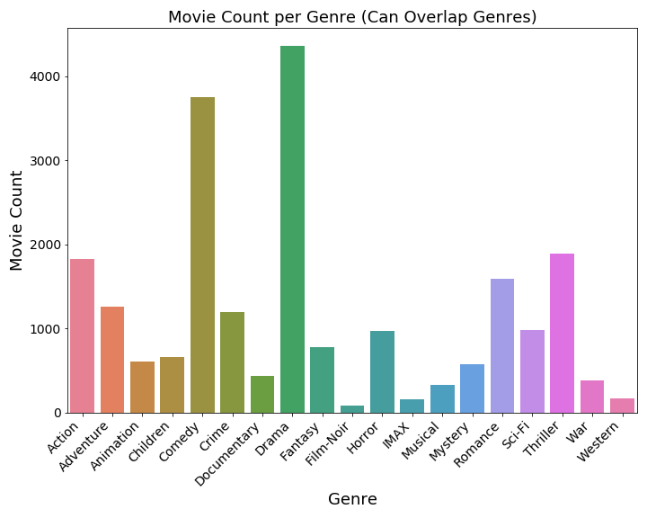
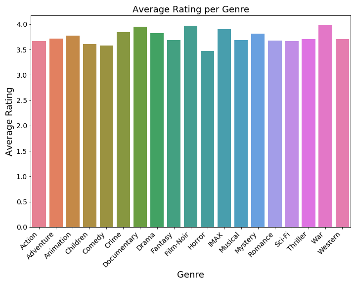
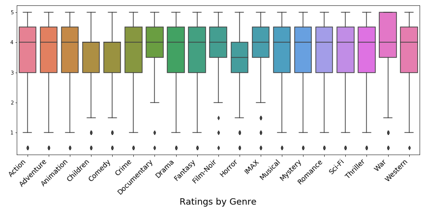
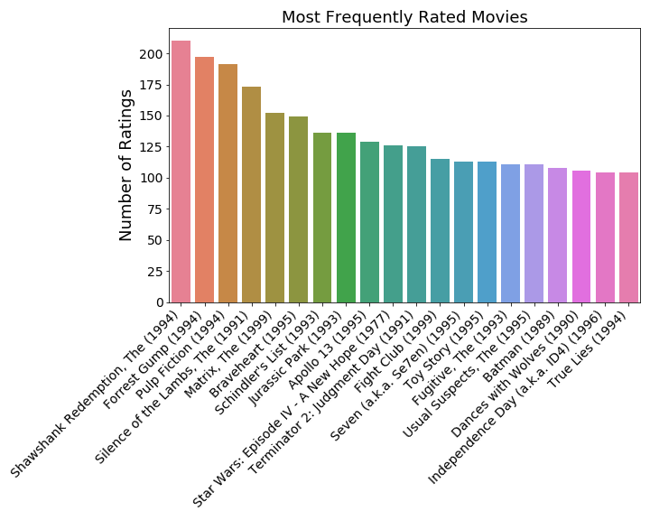
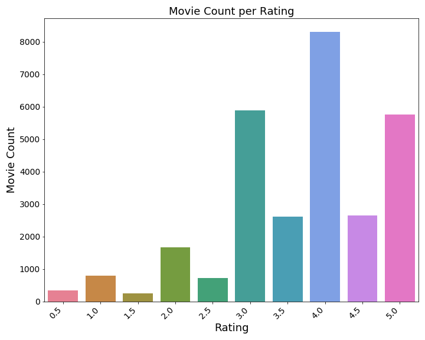

# Module 4 Final Project

## Objective

Create a recommendation system using surprise that will make movie recommendations for new users using datasets from [MovieLens](https://grouplens.org/datasets/movielens/latest/).

## The Datasets

The MovieLens database contains two datasets that were used for the project. 

[movies.csv](movies.csv): containing the movie id, title and genres for 9,742 unique movies. 

[ratings.csv](ratings.csv): containing the user id, movie id, rating and timestamp for 100,836 movie ratings. 

## Data Analysis

___

___

___

___

## Method

## Collaborative Filtering for Recommendation Systems:

Surpise, a python library, will be used to analyze different collaborative filtering algorithms for creating a recommendation system. The following algorithms will be created and evaluated

### memory based/neighborhood based collaborative filtering: 

Memory based, or neighborhood based, collaborative filtering algorithms quantify how similar users or items are to one another. These algorithms measure similarity between users or items, by different "similarity metrics". User vs items based, and pearson, pearson_baseline, cosine and MSD similarity metrics, will all be tested within the parameter grids, for each algorithm. The following neighborhood-based collaborative filtering methods will be tested: https://surprise.readthedocs.io/en/stable/knn_inspired.html

    *KNNBasic: A basic collaborative filtering algorithm
    *KNNBaseline: A basic collaborative filtering algorithm taking into account a baseline rating.
    *KNNWithMeans: A basic collaborative filtering algorithm, taking into account the mean ratings of each user.
    *KNNWithZScore: A basic collaborative filtering algorithm, taking into account the z-score normalization of each user.

Each of the algorithms will have the following parameter grid:
    
    *k: The (max) number of neighbors to take into account for aggregation
    *min_k: The minimum number of neighbors to take into account for aggregation

    *Item-based: measure the similarity between the items that target users rates/interacts with and other items
    vs.
    *User-based: measure the similarity between target users and other users 

Similarity metrics: https://surprise.readthedocs.io/en/stable/similarities.html

    *pearson: Calculate Pearson correlation coefficients between all user (or item) pairs
    vs.
    *cosine: Calculate cosine similarity between all user (or item) pairs
    vs.
    *MSD: Calculates the mean squared difference between similarity between all user (or item) pairs   
    vs. 
    *pearson_baseline: Calculates shrunk Pearson correlation coefficient between all user (or item) pairs
    

### Model based collaborative filtering: 

Another way to make recommendation systems is by using model based collaborative filtering. Model based filtering can make predictions by viewing the dataset as a matrix, and by decomposing that matrix into individual matrices. This reduction of dimensionality can be completed using Singular-Value Decomposition or SVD. With SVD, the recommendation problem is turned into an optimization problem that deals with how good we are in predicting the rating for items given a user. The optimization is completed by minimizing the squared error using gradient descent. 

https://surprise.readthedocs.io/en/stable/matrix_factorization.html

Alternating least squares is another matrix decomposition method, but it is best used when there are missing values in the matrix. Because our dataset does not contain missing values, we will stick to SVD for matrix decomposition. 

Parameter grid for SVD: 

    *n_epochs: the number of iterations of SGD, which is basically an iterative method used in Statistics to minimize a function.
    *lr_all: the learning rate for all parameters, which is a parameter that decides how much the parameters are adjusted in each iteration.
    *reg_all: the regularization term for all parameters, which is a penalty term added to prevent overfitting.
    
### Scoring:

    *Mean Absolute Error (MAE) computes the deviation between predicted ratings and actual ratings

    *Root Mean Square Error (RMSE) is similar to MAE, but places more emphasis on larger deviation (punishes gross inaccuracies)

## Findings

According to the MAE scores, the KNNBaseline model performed the best of all of the collaborative filtering algorithms. The MAE score was chosen due to its intuitive nature - for a rating system of 0-5 stars, an MAE of 0.7 means that the predicted rating is on average, +/- 0.7 stars off from the actual rating. The KNNBaseline algorithm was then used to create a model which recommends movies for a new user. The new user us asked to input 5 ratings of movies that have seen to address the cold start problem. 

This recommendation system can be used for any adult looking to watch a new movie. If the genre was filtered to "Children", it could also be used for children, with adult supervision. 

## Table of Contents

[Jupyter_Notebook](RecSystem.ipynb)

[Summary_Slides](MovieRecPresentation.pdf)

[Blog_Post](https://medium.com/@stacyshingleton/movie-recommendations-65aa0566215c)
